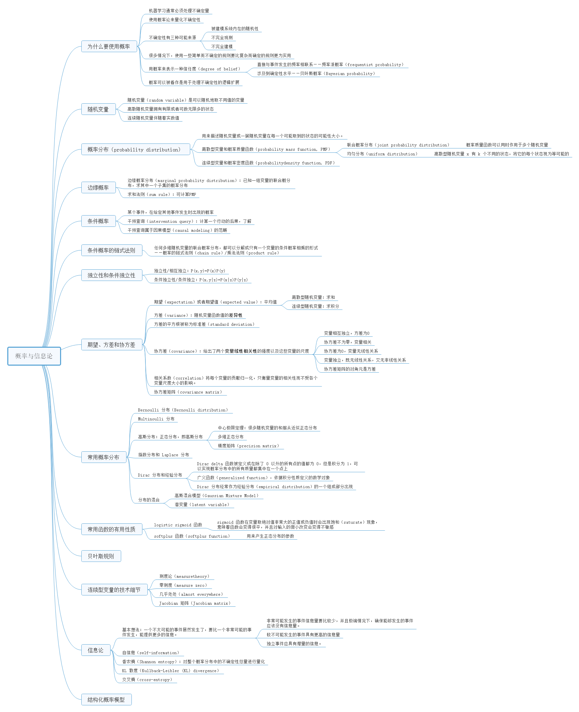
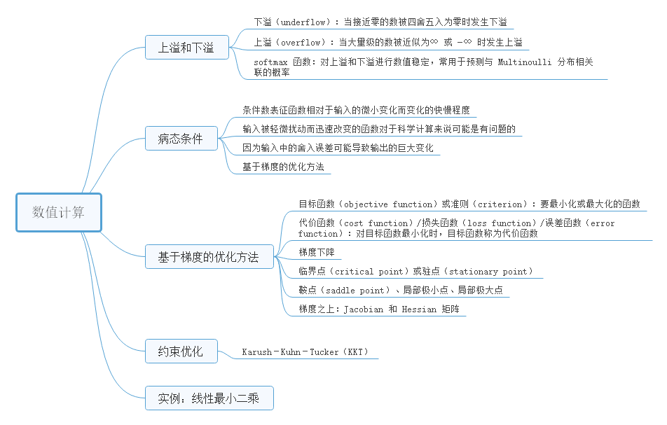
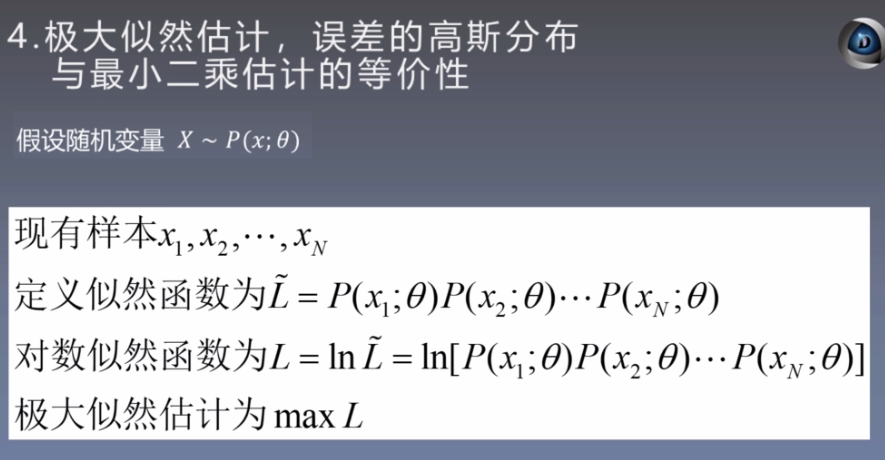
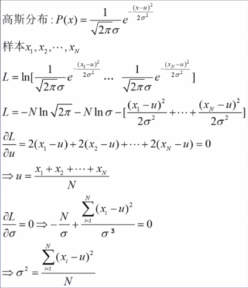
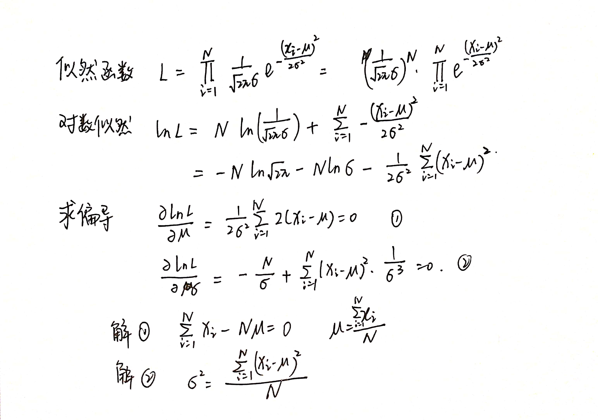
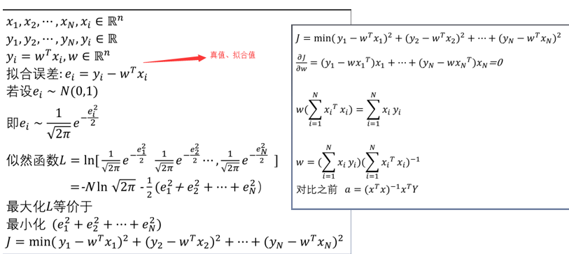
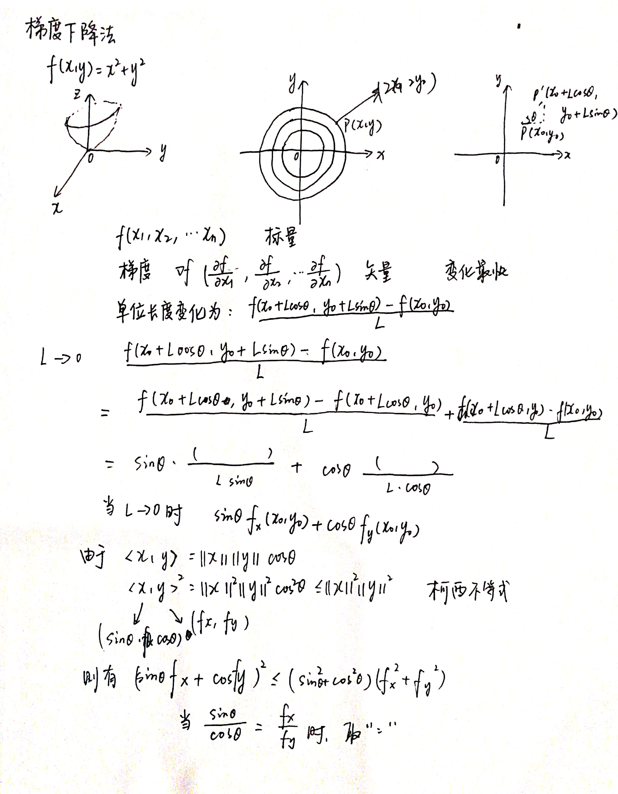
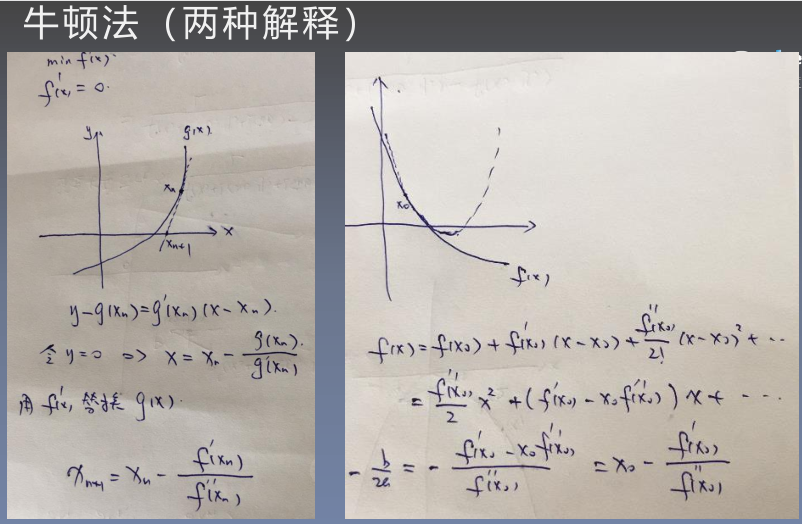
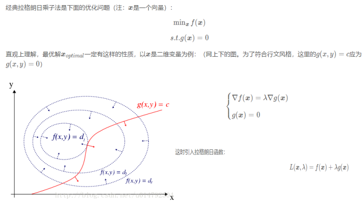
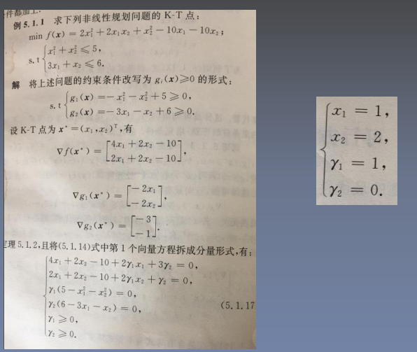

第一周 8月1日—8月2日

花书第三四章

花书中文版 [https://github.com/exacity/deeplearningbook-chinese](https://github.com/exacity/deeplearningbook-chinese)

极大似然估计、误差的高斯分布、最小二乘的等价性、有约束最优化、无约束最优化

<!--more-->

# 概率与信息论

# 数值计算

# 极大似然估计

### 极大似然估计

- 各个样本独立同分布
- 各个样本函数相乘
- 对数似然估计，将乘法变为加法
- 极大似然估计，偏导

### 误差的高斯分布

### 最小二乘的等价性

- wx'= w'x, w、x为向量

# 无约束最优化

# 有约束最优化

