花书第一二章，第一周 7月30日-7月31日

包含线性代数部分及标量对矩阵求导
线性代数部分-视频课深度之眼花书训练营

标量对矩阵求导参考
[https://zhuanlan.zhihu.com/p/24709748](https://zhuanlan.zhihu.com/p/24709748)

<!--more-->

# 线性代数

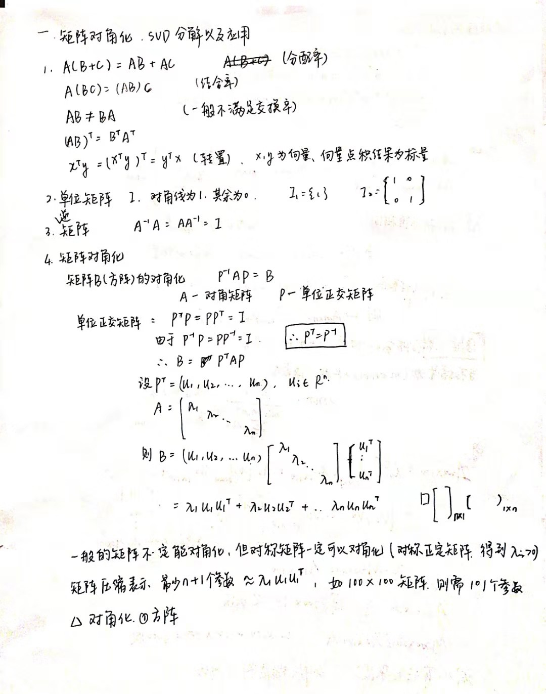

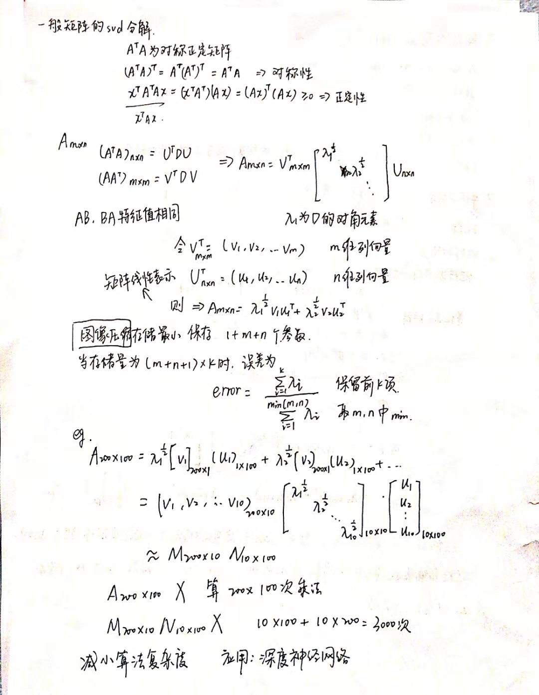

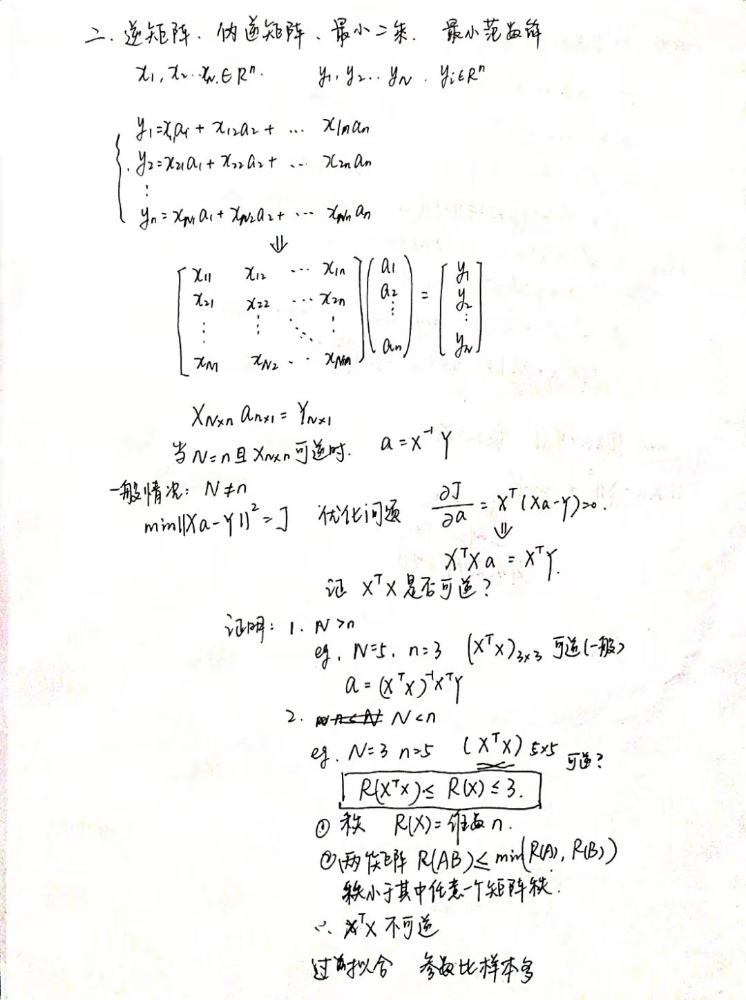

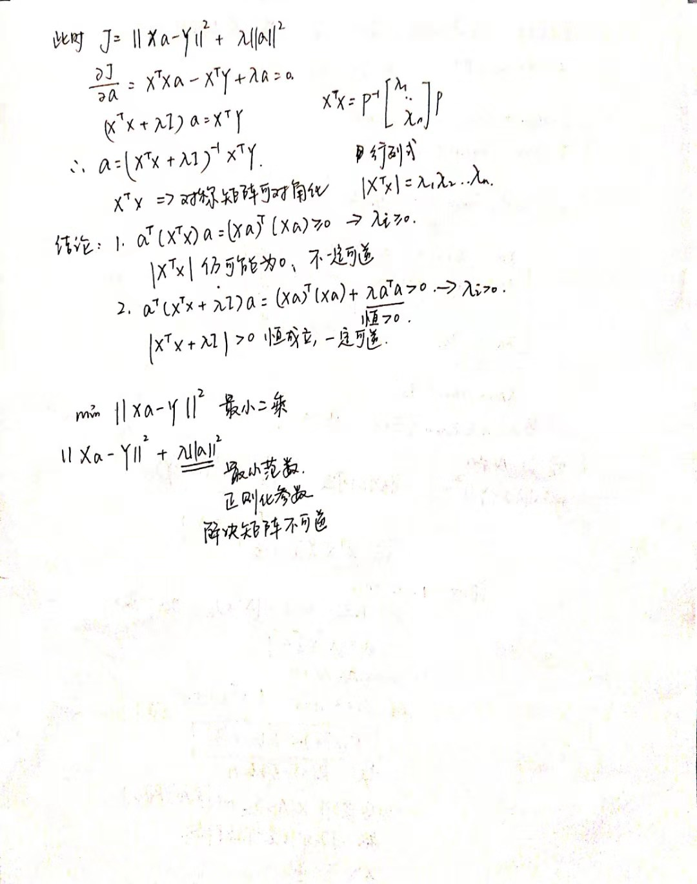

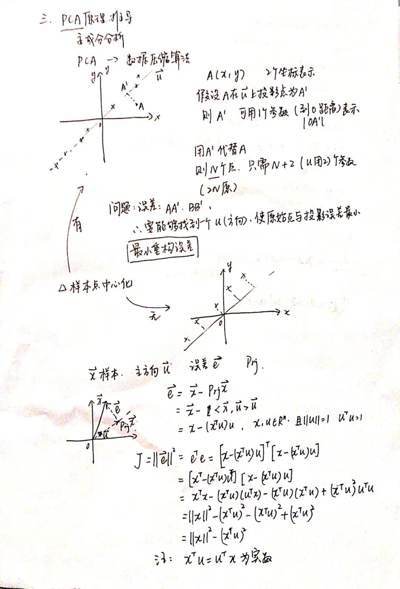

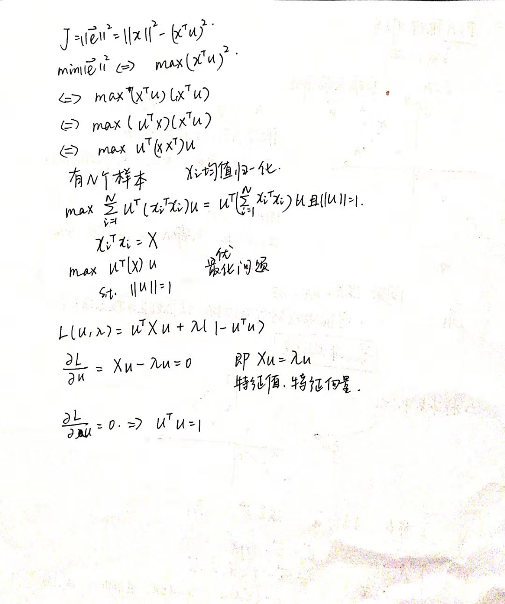

# 标量对矩阵求导

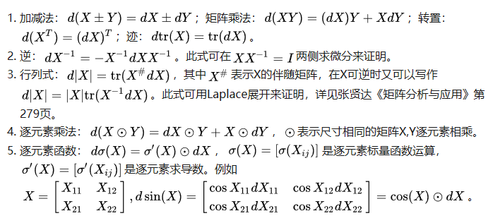

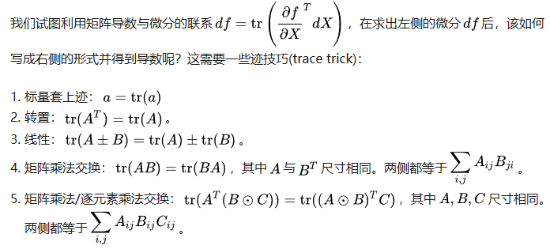

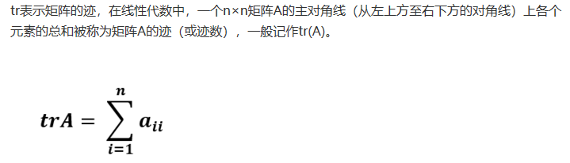

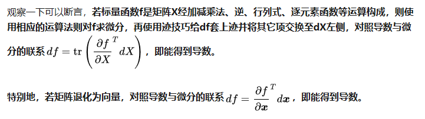

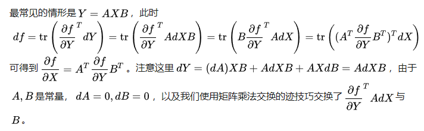

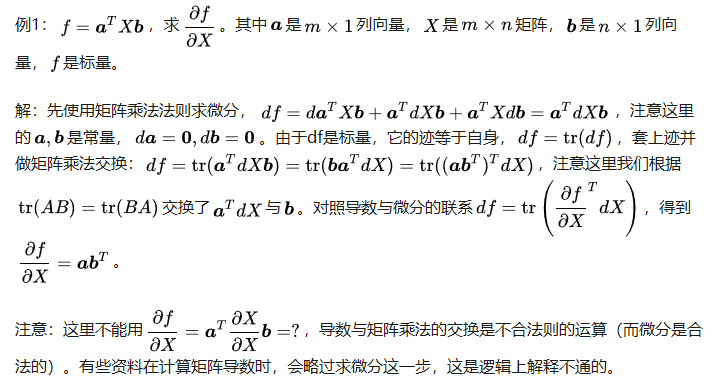

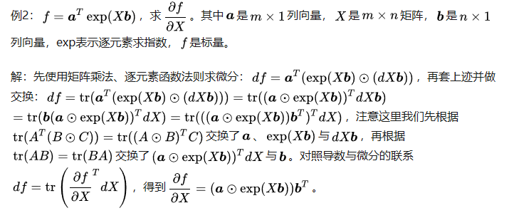

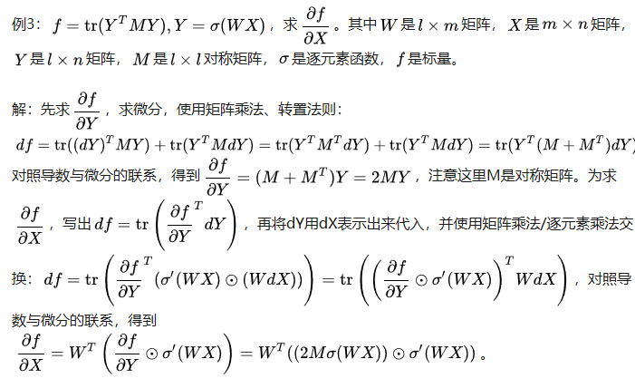

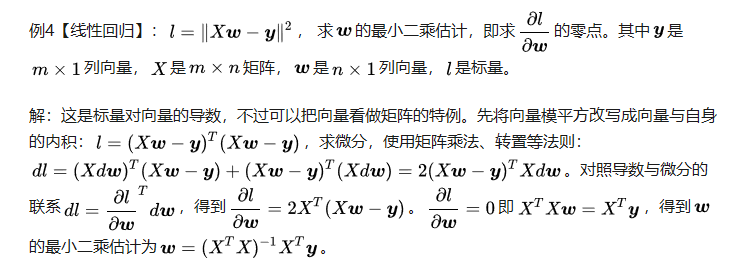
