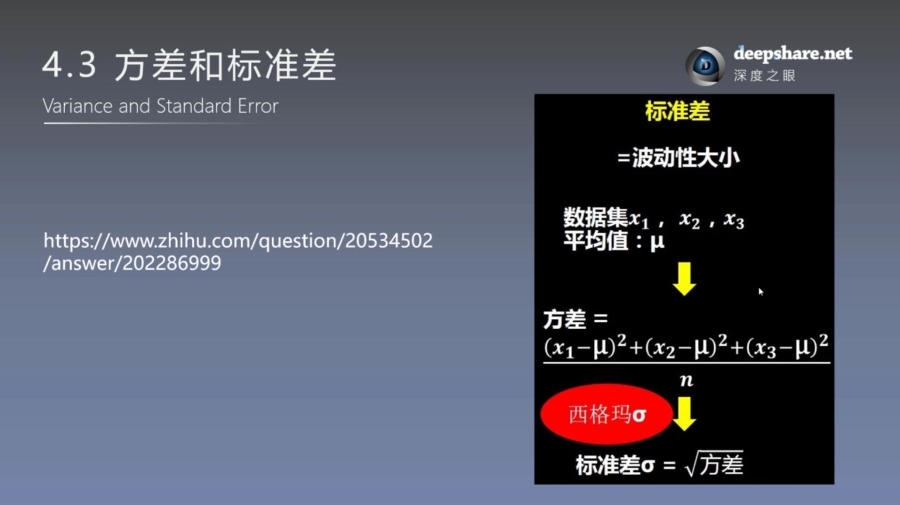
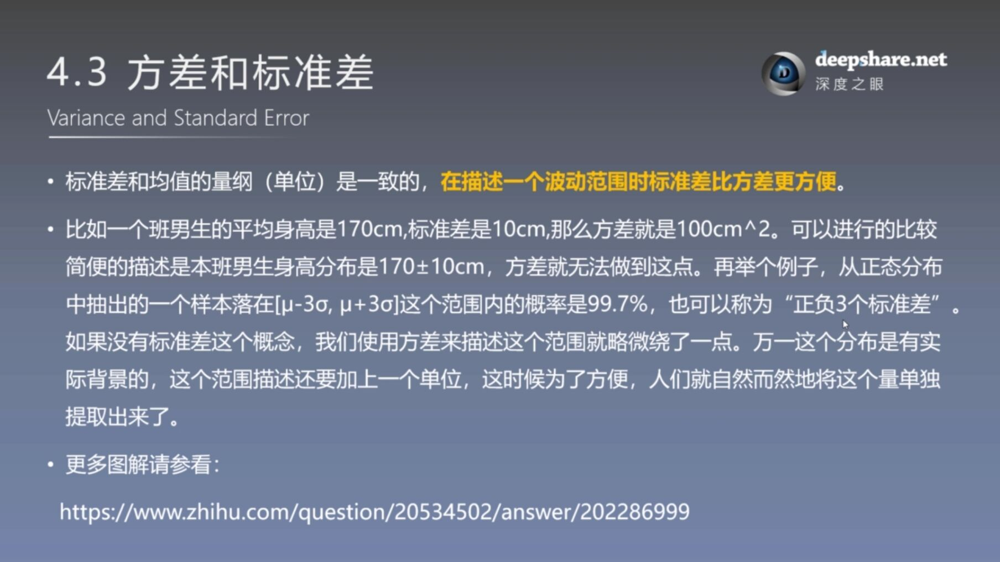

第二周 8月5日——8月6日

花书第五章 机器学习基础

5.1 学习算法（任务T、性能度量P、经验E）

5.2 容量、过拟合和欠拟合

5.3 超参数和验证集

5.4 估计、偏差和方差

方差和标准差：https://www.zhihu.com/question/20534502/answer/202286999

<!--more-->

# 学习算法

# 容量、过拟合和欠拟合

# 超参数和验证集

# 估计、偏差和方差

- 偏差大小：与真实值的偏离大小
- 方差大小：数据分散程度

方差单位和数据的单位不一致，没法使用。标准差和数据的单位一致，使用起来方便。

方差和标准差：https://www.zhihu.com/question/20534502/answer/202286999

