## 前馈神经网络结构表达能力

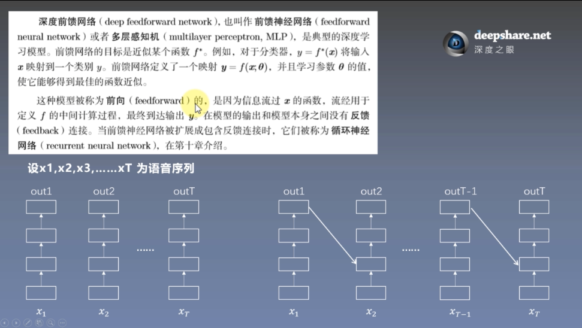  
前馈神经网络——一个特征经过变换后直接输出  
循环神经网络（RNN）——某个特征变换后的某个输出是另一个特征变换的输入，中间存在反馈机制

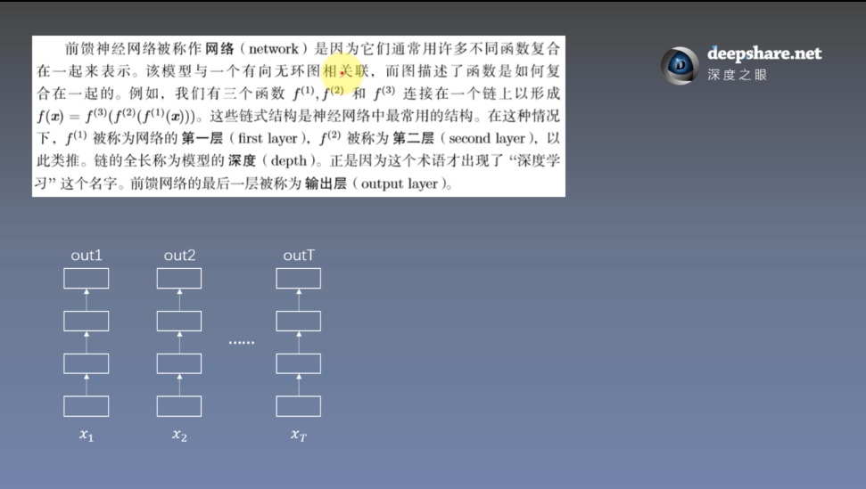  
例如：经过第一个隐层，函数为f1，结果：f1（x1）  
经过第二个隐层，函数为f2，结果：f2（f1（x1））  
经过第三个隐层，函数为f3，结果：f3（f2（f1（x1）））  
一般情况下，中间层可为线性/非线性变换，最后一层为**线性变换**

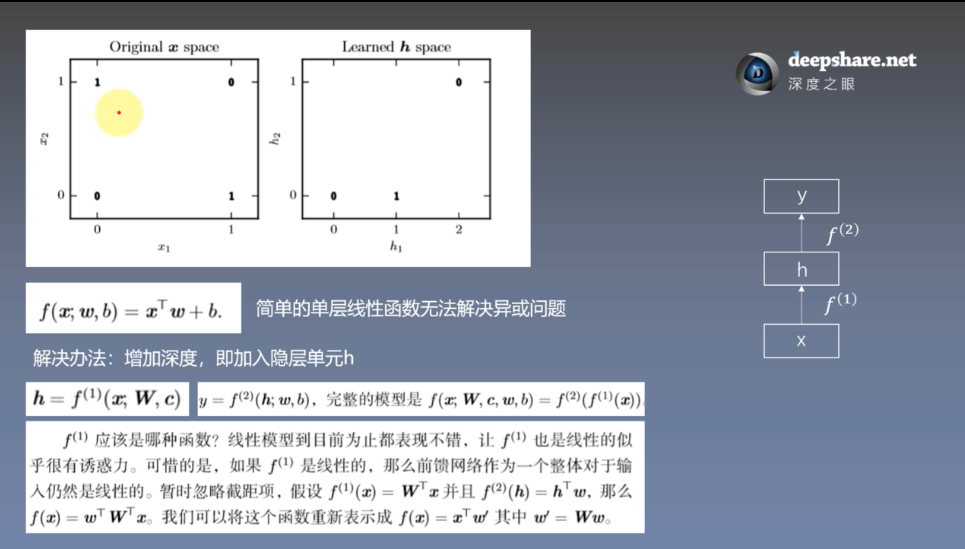

序号 | 输入 | 输出
---| ---| -------------|
1 | (0,0) | 0 |
2 | (1,0) | 1 |
3 | (0,1) | 1 |
4 | (1,1) | 0 |

简单单层线性函数 y=w1x1 + w2x2 + b  无法解决异或问题，没有办法画出一条直线进行分类  
因此我们可以增加深度，即加入隐层单元  
x——f1——h，h见图2

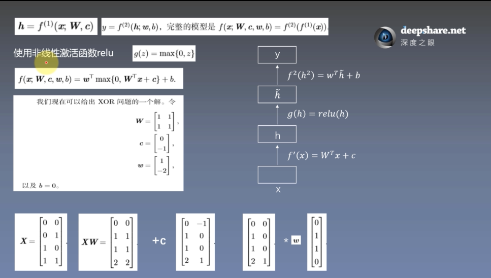  
f1 = relu（w'x+c）  
relu = 0 (x<=0) , x (x>0)  
X——行-样本数，列-维度  
+c之后通过relu  

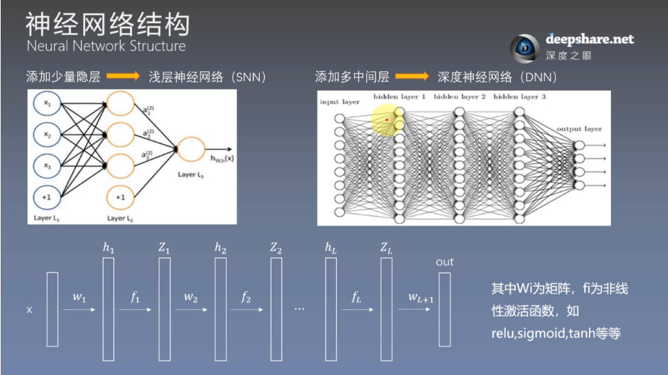  
h1 Z1 可看作第一个隐层  

  
1-理论上经过h1 Z1 后可以逼近任何连续函数  
2-单隐层参数很难学习，多隐层容易  
3-根据过往经验选择层数

层数增多后，需要学习的参数多，模型容量会变大，导致在训练集得到结果好，测试集结果变差，过拟合问题  
解决：正则化、dropout等  
dropout，如DNN中，节点全连接，dropout就是随机砍掉一些边

## 激活函数

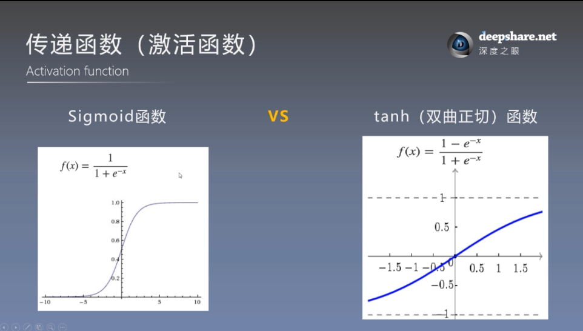  
中心点，饱和点不同

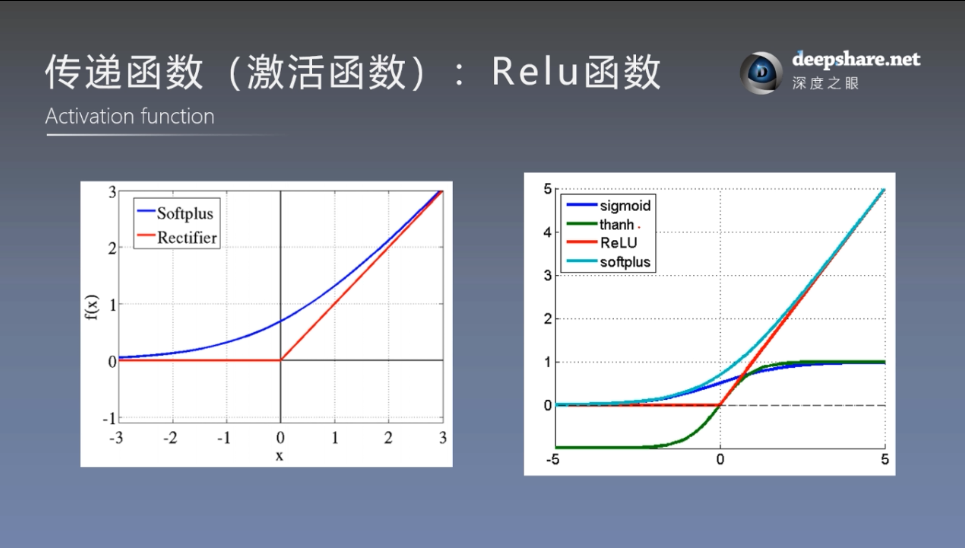

   
Sigmod 优点：噪声情况下变得稳定，尤其是在饱和区中

## 损失函数

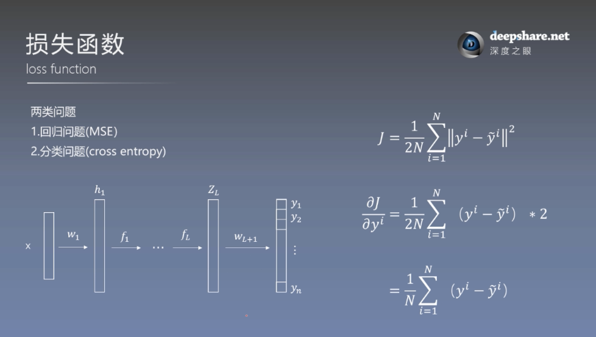  
yi=（yi1……yiN）

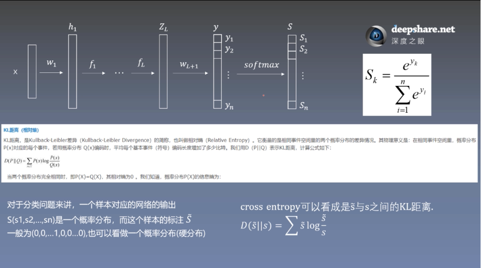  
KL距离——两个概率的差异

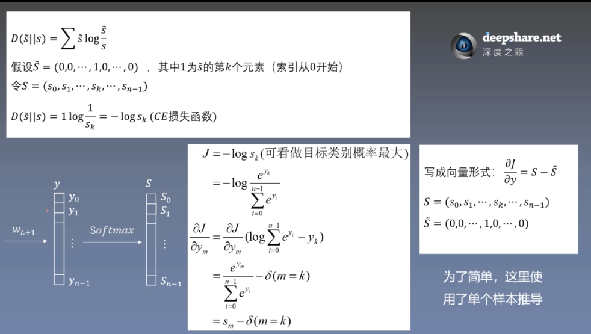  

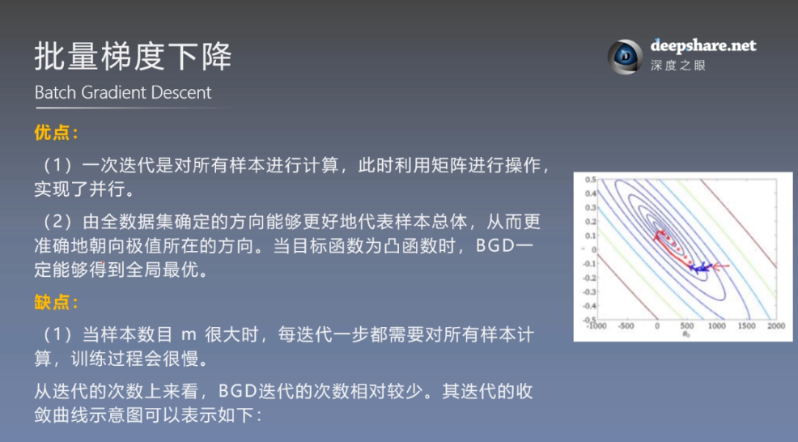  
对所有样本

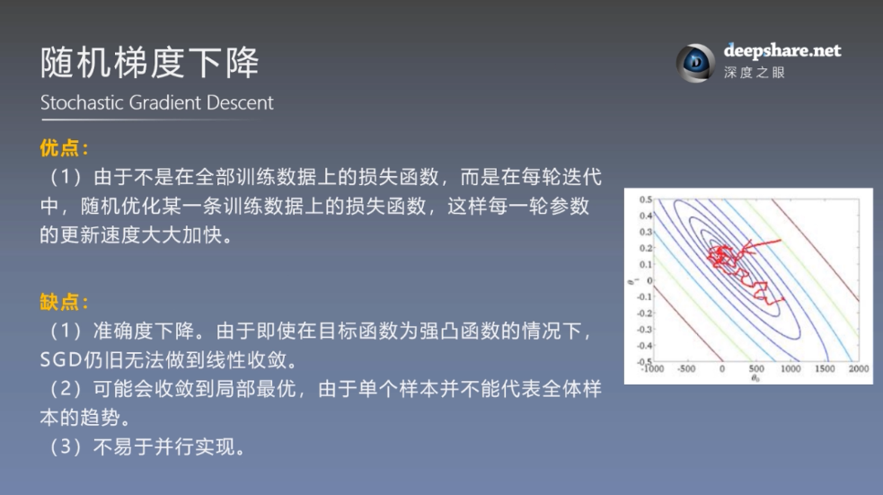  

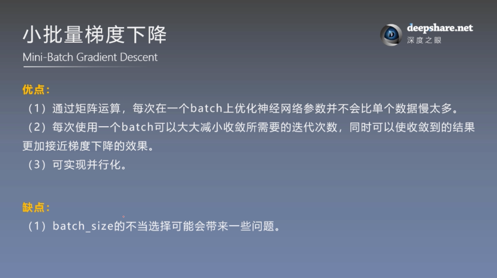  

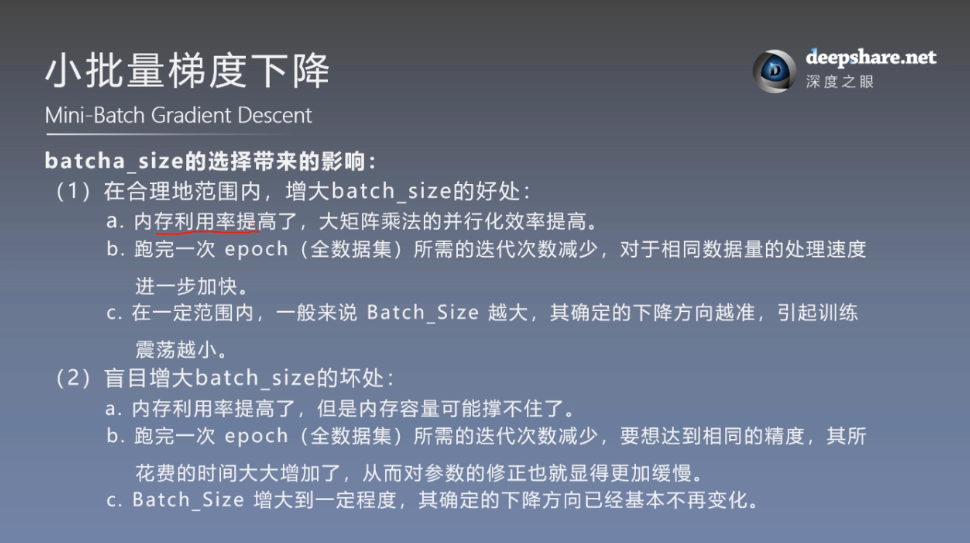  
