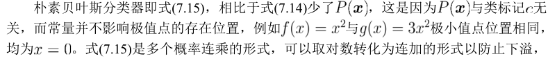

# 贝叶斯决策论

# 极大似然估计

极大似然估计（Maximum Likelihood Estimation，MLE）

## 估计类条件概率常用策略

1. 假定其具有某种确定的概率分布形式

2. 基于训练样本对概率分布进行参数估计

<!--more-->

## 参数估计（parameter estimation）

- 概率模型的训练过程就是参数估计过程。对参数估计，统计学界两个学派提供不同解决方案。

|  |观点|解决方案|
---|:--|:---
频率主义学派（Frenquentist）|参数虽然未知，但却是客观存在的固定值|可通过优化似然函数等准则来确定参数值
贝叶斯学派（Bayesian）|参数是未观察到的随机变量，其本身也可有分布|可假定参数服从一个先验分布，然后基于观测到的数据来计算参数的后验分布

- 本节介绍源自频率主义学派的极大似然估计——根据数据采样来估计概率分布参数的经典方法

## 极大似然估计/极大似然法 MLE

- 7.9 原始似然表达式
- 待求模型参数c，极大似然目标是寻找当前数据集更像是由哪组模型参数c生成的
- 由于c均小于1，连乘容易造成下溢。解决下溢的常用方法是取对数，将连乘变为连加，即7.10
- 得到对数似然表达式后，在c可行域内最大化似然函数即得极大似然估计，即7.11
- arg max 使后面式子达到最大时变量的取值

## MLE评估

- 优： 使类条件概率估计变得简单

- 缺：估计结果的准确性严重依赖于所假设的概率分布形式是否符合潜在的真实数据分布

- 现实应用中，想得到能较好地接近潜在真实分布的假设，常需要在一定程度上利用关于应用本身的经验知识。仅凭“猜测” 来假设概率分布形式，很可能产生误导性结果。

# 朴素贝叶斯分类器

## 朴素贝叶斯分类器概念

- 基于贝叶斯公式7.8来估计后验概率 P(c|x) 主要困难：类条件概率 P(x|c) 是所有属性上的联合概率，难以从有限的训练样本直接估计而得。

- 朴素贝叶斯分类器（Naive Bayes classifier）采用“属性条件独立性假设”（attribute conditional independence assumption）避免上述障碍

- 属性条件独立性假设：对已知类别，假设所有属性互相独立。即，假设每个属性独立地对分类结果发生影响

## 朴素贝叶斯分类器条件概率估计方法

- 离散属性：直接按频率计数。 |·|——求集合元素的个数

- 连续属性：连续变量必须假设一种概率分布，此处概率密度函数并非概率，即取值范围不是0~1。

### 举例

## 拉普拉斯修正

### 评估

拉普拉斯修正避免了因训练样本不充分而导致概率估值为零的问题，并且在训练集变大时，修正过程所引入的先验的影响也会变得可忽略，使得估值渐趋向于实际概率值

## 朴素贝叶斯分类器使用方式

# EM算法

