# 神经元模型

- 神经网络（neural networks）：神经网络是由具有适应性的简单单元组成的广泛并行互连的网络，它的组织能够模拟生物神经系统对真实世界物体所作出的“交互反应”。[Kohonen, 1988].机器学习中神经网络指“神经网络学习”或机器学习和神经网络交叉部分

- 神经元（neuron）模型：“简单元”

- “阈值”（threshole）：生物神经网络，每个神经元与其它神经元相连，“兴奋”时，向相连神经元发送化学物质，从而改变神经元电位；如果某种神经元的电位超过一个阈值，那么它就会被激活，从而“兴奋”起来，向其他神经元发送化学物质

<!--more-->

## M-P神经元模型

- M-P神经元模型：1943年，[McCulloch and Pitts, 1943],将上述情形抽象为下图所示简单模型，即 M-P神经元模型

- 模型解释：神经元接收到来自n个其他神经元传递过来的输入信号，这些输入信号通过带权重的连接（connection）进行传递，神经元接收到的总输入值将与神经元的阈值进行比较，然后通过“激活函数”（activation fuction）处理以产生神经元的输出。

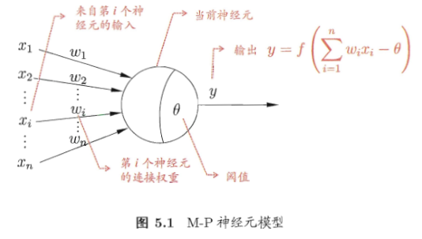

## 激活函数

- 理想的激活函数是阶跃函数：图（a）将输入值映射为输出值“0”或“1”。1-神经元兴奋，0-神经元抑制

- 阶跃函数缺陷：具有不连续，不光滑等不太好的性质，因此实际常用Sigmoid函数作为激活函数

- 典型的Sigmoid函数：图（b），把可能在较大范围内变化的输入值挤压到（0，1）输出值范围内，也称为“挤压函数”（squashing fucnction）

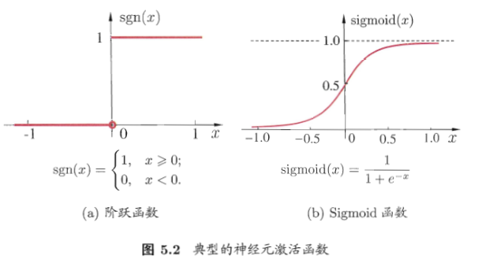

## 小结

# 感知机与多层网络

## 感知机（Perceptron）

- 感知机由两层神经元组成。输入层接收外界输入信号后传递给输出层，输出层是M-P神经元，亦称“阈值逻辑单元”（threshold logic unit）

- 感知机功能：能容易的实现逻辑与、或、非运算。

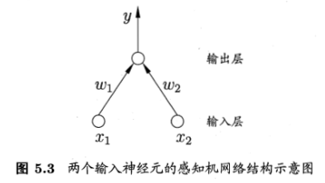

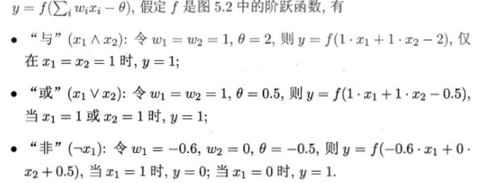

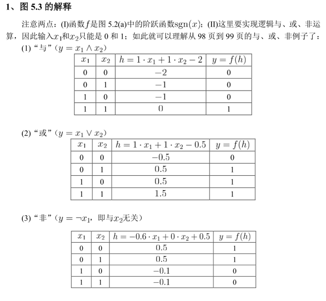

- 给定训练数据集，权重和阈值可通过学习得到。

### 感知机学习规则

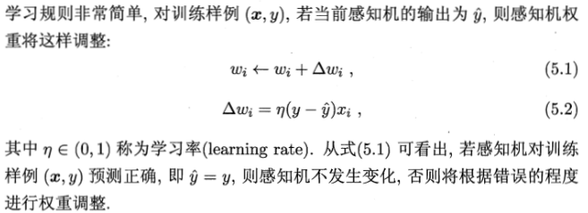

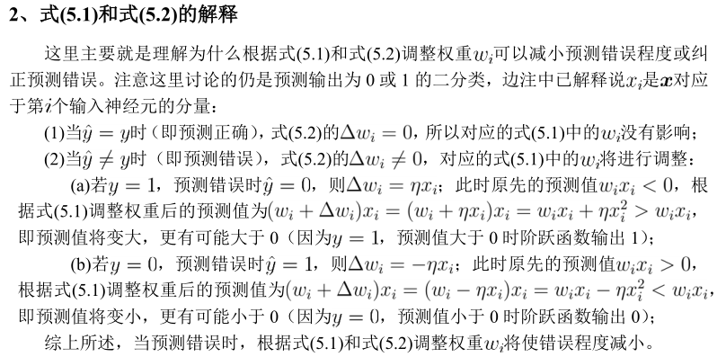

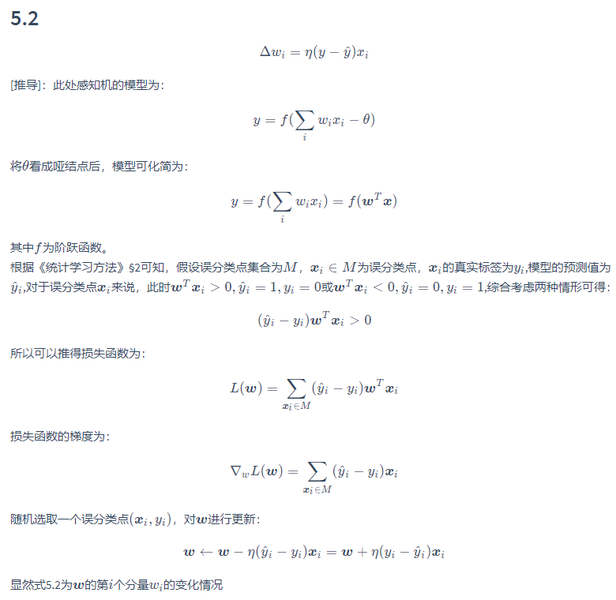

## 线性可分与非线性可分问题

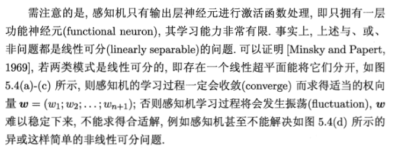

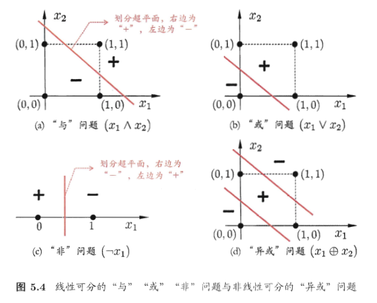

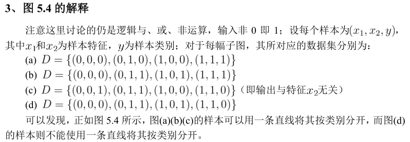

### 解决非线性可分问题——两层感知机（异或问题）

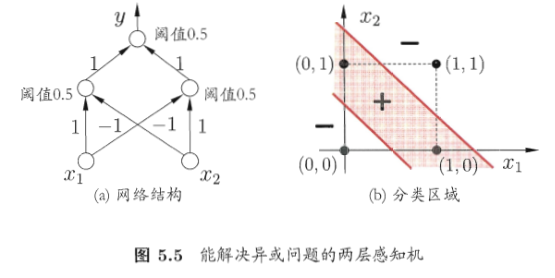

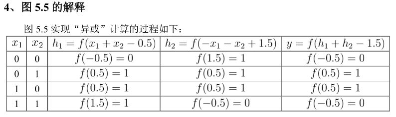

## 多层前馈神经网络

- 多层前馈神经网络（multi-layer feedforward neural network）：层级结构，每层神经元与下一层神经元全互连，神经元之间不存在同层连接，也不存在跨层连接

- 输入层神经元接受外界输入，隐层与输出层神经元对信号进行加工，最终结果由输出层神经元输出。即，输入层神经元仅是接受输入，不进行函数处理，隐层与输出层包含功能神经元

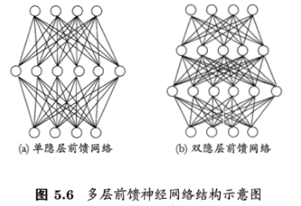

- 图a——两层网络或单隐层网络

- 多层网络：只需包含隐层，即可称为多层网络

- 神经网络学习过程：就是根据训练数据来调整神经元之间的“连接权”（connection weight）以及每个功能神经元的阈值。即，神经网络学到的东西，蕴涵在连接权与阈值中。

# 误差逆传播算法

误差逆传播算法（error BackPropagation， BP）：训练多层网络，最成功的神经网络学习算法。不仅可以用于多层前馈神经网络，还可用于其他类型的神经网络，如训练递归神经网络。通常，“BP网络”，一般指用BP算法训练的多层前馈神经网络。

## BP算法

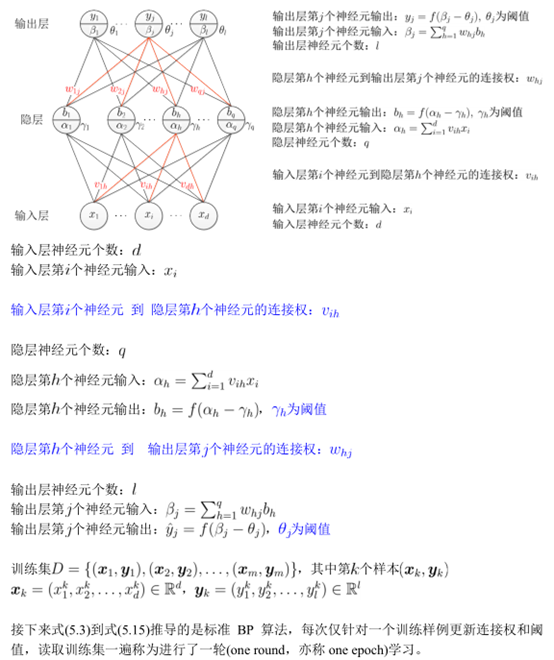

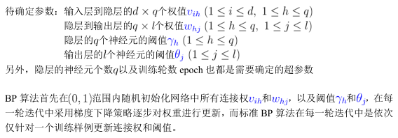

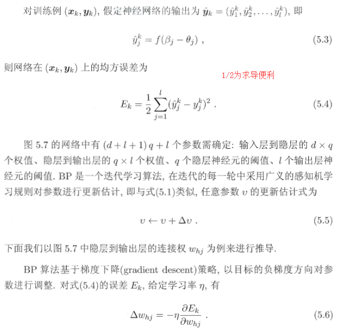

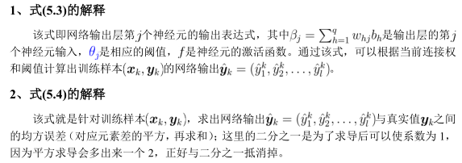

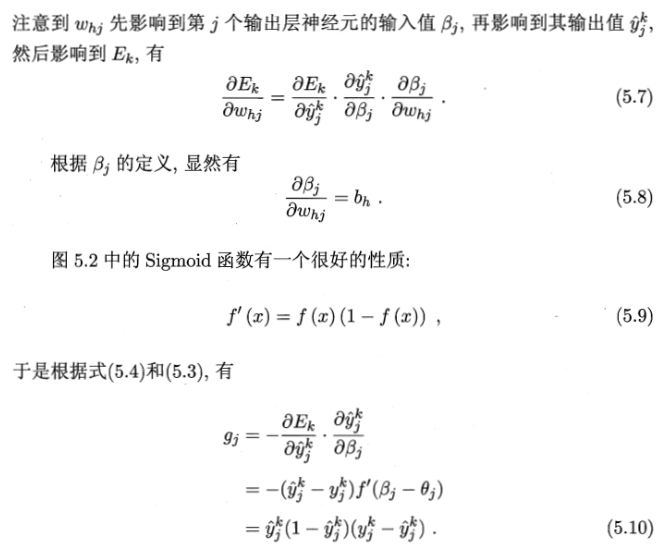

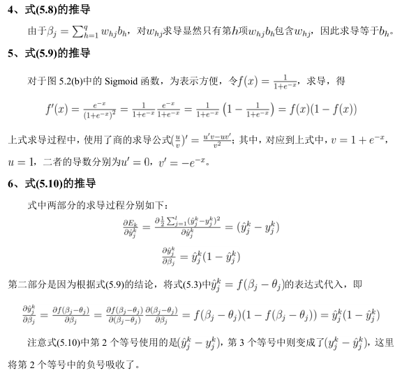

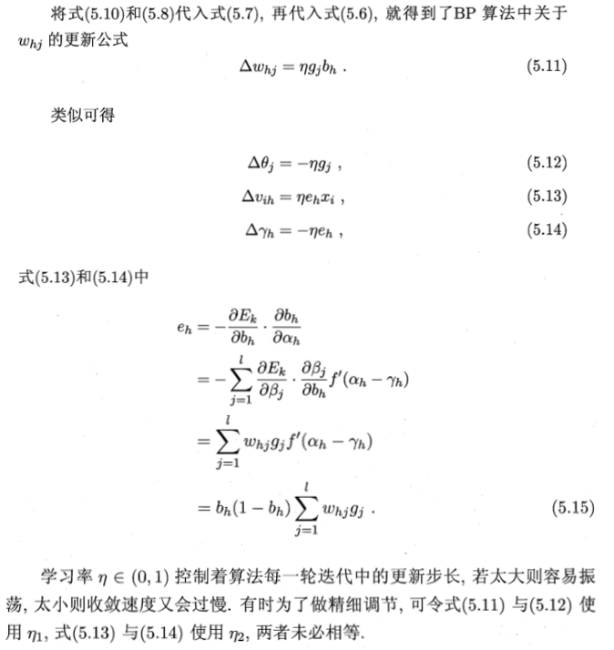

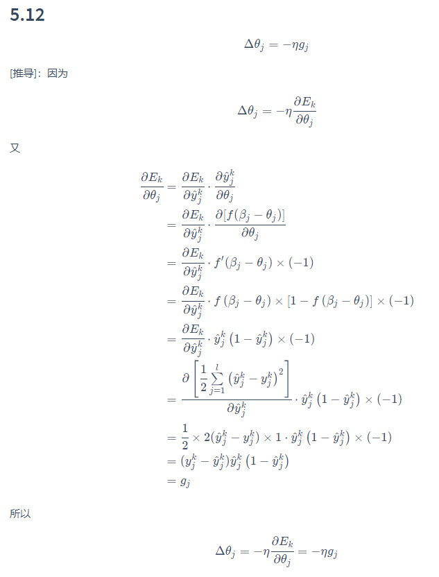

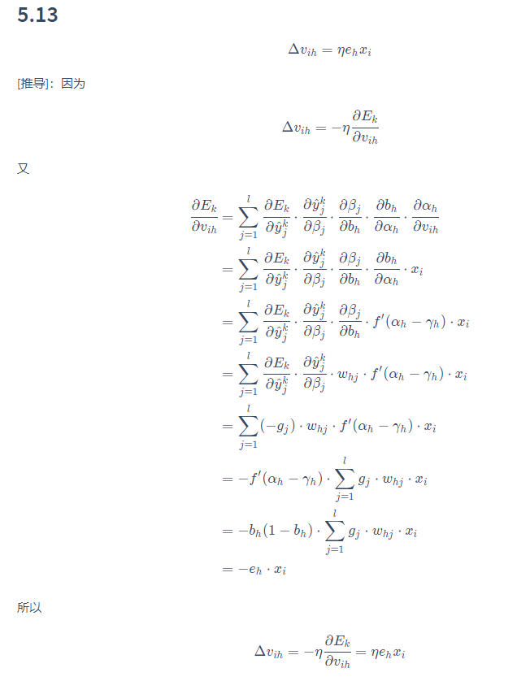

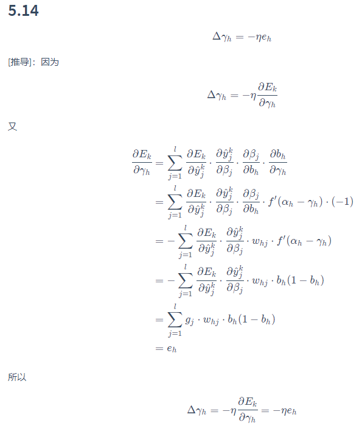

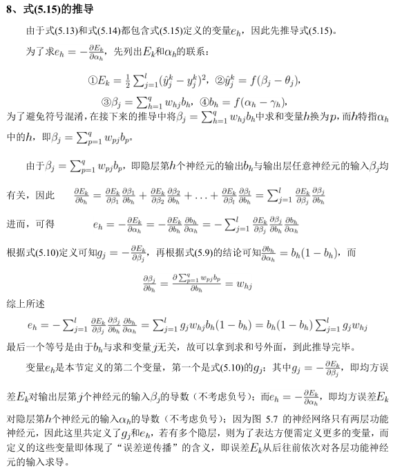

# 全局极小与局部极小

若E表示神经网络在训练集上的误差，E是关于连接权w和阈值的函数。神经网络训练过程可看作一个参数寻优过程，即，在参数空间中，寻找一组最优解使得E最小

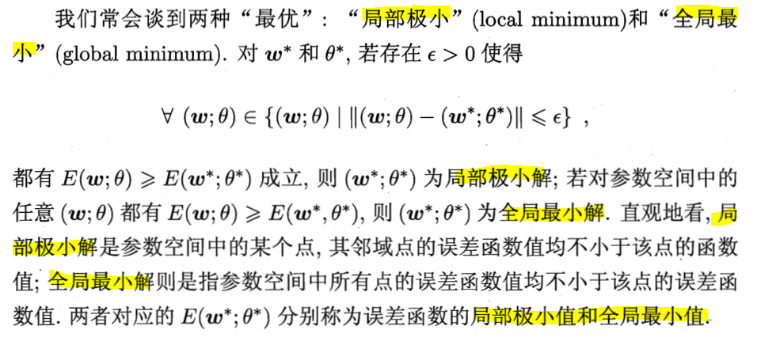

局部极小点：参数空间中内梯度为0的点，只要其误差函数值小于邻点的误差函数值，就是局部极小

可能存在多个局部极小值，但却只会有一个全局最小值

全局最小一定是局部极小，反之不成立

基于梯度的搜索是使用最为广泛的参数寻优方法。

遗传算法常用来训练神经网络以更好的逼近全局最小。

## “跳出”局部极小策略

- 以多组不同参数值初始化多个神经网络
