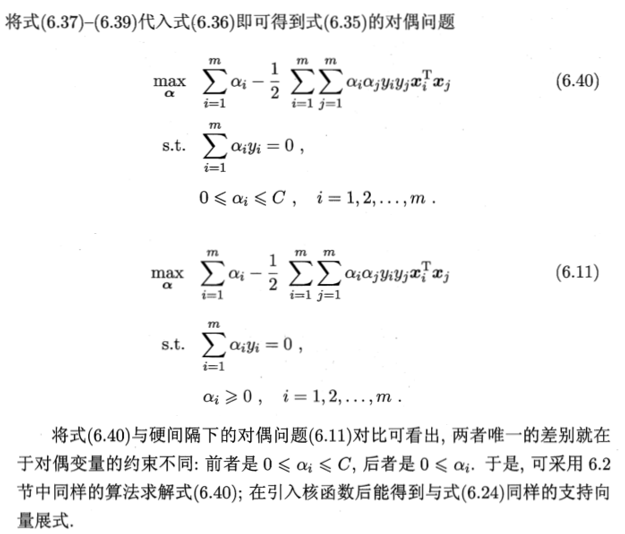

# 间隔与支持向量

## 预备知识1 向量投影

<!-- more -->

## 预备知识2 超平面法向量

## 划分超平面

分类学习的基本想法：基于训练集D在样本空间中找到一个划分超平面，将不同类别的样本分开。

**如何寻找划分超平面？**
- 位于两类训练样本“正中间”的超平面，对训练样本局部扰动的“容忍”性最好。
- 例：由于训练集的局限性或噪声，训练集外样本可能比图中训练样本更接近两个类的分割界，红色超平面受影响最小，即，这个划分超平面产生的分类结果是鲁棒的，对未见示例的泛化能力最强

## 支持向量与间隔

支持向量（support vector）：距离超平面最近的几个训练样本点使6.3的等号成立，被称为支持向量

间隔（margin）：两个异类支持向量到超平面距离之和

## 支持向量机基本型

**【解释6.6】**
- 6.6约束条件：训练样本线性可分，即不存在被分类错误的样本，因此不存在欠拟合问题
- 6.6目标函数：寻找最大间隔的划分超平面——分类结果最鲁棒、对未见示例的泛化能力最强，相当于寻找最不可能过拟合的分类超平面
- 防止过拟合引入正则化，正则化——在最小化的目标函数中加入分类器的所有参数的模值的平方

# 对偶问题

## 拉格朗日乘子法

不考虑极值是否存在，假设优化问题一定有解

### 如何求下确界表达式？

## 对偶问题

用拉格朗日乘子法求解式（6.6）即可得到其“对偶问题”

### 式6.8

### 式6.9、6.10

### 式6.11

### 式6.12

将式6.9直接代入即可

x——待预测示例（未见示例）

xi——预测中示例

拉格朗日乘子求解——SMO算法

已知拉格朗日乘子，6.9求得w，6.17和6.18得到偏移项b

## KKT条件（Karush-Kuhn-Tuchker）

拉格朗日乘子对应训练样本（xi，yi），上述过程需满足KKT条件（Karush-Kuhn-Tuchker）

注：1.不等式约束拉格朗日乘子不小于0；2.（6.6）约束条件，用f（xi）代替wx+b； 3.前两式必有一个为0

**支持向量重要性质1：训练完成后，大部分训练样本都不需要保留，最终模型仅与支持向量有关**

[KKT conditions and Duality](http://www.csc.kth.se/utbildning/kth/kurser/DD3364/Lectures/Duality.pdf)

[Lagrange Multipliers and the Karush-Kuhn-Tucker conditions](http://www.csc.kth.se/utbildning/kth/kurser/DD3364/Lectures/KKT.pdf)

## SMO（Sequential Minimal Optimization）算法

**提出原因**：6.11是二次规划问题，可使用通用二次规划算法求解，然，该问题规模正比于训练样本数，在实际任务中开销大。

基本思想

注：只要ai，aj中有一个不满足KKT，目标函数就会在迭代后减小

KKT违背程度越大，变量更新后可能导致的目标函数值减幅越大，SMO先选取违背KKT条件最大的变量，第二选取使目标函数值减小最快的变量

由于比较各变量对应目标函数值减幅的复杂度过高，SMO采用启发式：使选取的两变量对应样本间间隔最大，即差别大的变量比相似变量更新，带给目值更大的变化

SMO高效原因：固定其他参数后，仅优化两个参数过程能做到非常高效，具体，仅考虑ai和aj时，6.11中约束可重写为

# 核函数

假设训练样本线性可分，即存在一个划分超平面能将训练样本正确分类，实际中，“异或”问题就不是线性可分的

解决方法：将样本从原始空间映射到一个更高维的特征空间，使其在特征空间内线性可分。例：如图，将原始二维映射到三维，能找到一个合适的划分超平面。如果空间是有限维，即属性数有限，那么一定存在一个高维特征空间使样本可分。

## 特征空间划分超平面模型

注意：W维度不再与x相同

## 核函数（kernel function）

### 式6.22

式6.22 为核函数定义，即核函数可以分解成两个向量的内积

### 式6.24

式6.23求解后得到6.24， 6.24显示出模型最优解可通过训练样本的核函数展开，亦称“支持向量展式”（support vector expansion）

### 核函数定理

### 常用核函数

# 软间隔和正则化

## 解决问题

前面讨论中，假定训练样本在样本空间或特征空间中是线性可分的，即存在一个超平面能将不同类样本完全划分开，然，实际上，很难确定合适核函数使其在样本空间线性可分，即，即便找到某个核函数，也存在过拟合问题。缓解该问题的一个办法：允许支持向量机在一些样本上出错，引入“软间隔概念”

## 软间隔和硬间隔

硬间隔（hard margin）：所有样本满足约束6.3，即所有样本必须划分正确

软间隔（soft margin）：允许某些样本不满足约束6.28

## 软间隔优化目标及软间隔支持向量机

在最大化间隔同时，不满足约束条件的样本应尽可能少，优化目标可写为

## 替代损失

替代损失（surrigate loss）

替代损失函数具有较好的数学性质，如凸（函数）+ 连续函数 + 0/1 损失函数 的上界

### 三种常用的替代损失函数

## 软间隔支持向量机（6.35）的拉格朗日函数

6.35 中每个样本都有一个对应的松弛变量，表征该样本不满足约束6.28的程度，是二次规划问题，通过拉格朗日乘子法得到拉格朗日函数

## 软间隔支持向量机（6.35）的对偶问题

## 软间隔向量机，KKT 条件

## 对率回归与支持向量机关系

如果使用对率损失函数Llog来代替6.29中的0/1损失函数，几乎得到对率回归模型3.27

支持向量机与对率回归优化目标相近，通常情况下性能相当

|  | 输出 | 用处 | 函数 |
| :----: | :------: | :------: | :------: |
| 对率回归 | 输出具有自然的概率意义，即在给出预测标记的同时也给出了概率 | 可直接用于多分类任务 | 光滑单调递减函数，不能导出类似支持向量机的概念，因此解依赖于更多的训练样本，预测开销更大 |
| 支持向量机 | 输出不具有概率意义，进行特殊处理后得到概率输出 | 需特殊处理后用于多分类任务 | hinge有“平坦”零区域，使得支持向量机的解具有稀疏性 |

## 正则化（regularization）

正则化可理解为一种“罚函数法”，即对不希望得到的结果施以惩罚，从而使得优化过程趋向于希望目标。从贝叶斯估计的角度来看，正则化项可认为是提供了模型的先验概率。

